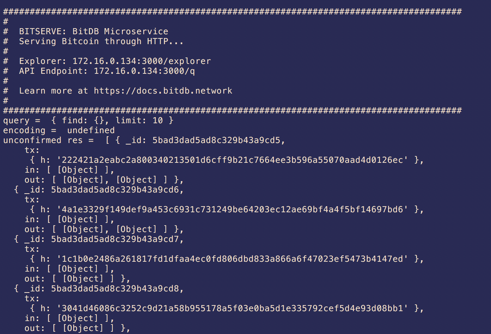

# rvnserve

> Rvndb Microservice

An API Endpoint + Web Query UI for RvnDB


# How it works

This project contains:

1. RvnDB Microservice API Endpoint: An HTTP API Endpoint to your RvnDB
2. RvnDB Query Web UI: As seen in [https://bitdb.ravencoin.online/v2/explorer](https://bitdb.ravencoin.online/v2/explorer)

## 1. RvnDB Microservice API Endpoint

Make HTTP requests to your rvndb node



## 2. RvnDB Query Web UI

Makes use of the API endpoint to render the query UI


# Prerequisites

You must have the following installed.

1. Ravencoin Full Node: Any RVN node implementation
2. Rvndb Node: Rvndb is a universal ravencoin database that autonomously synchronizes with Ravencoin https://rvndb.ravencoin.online


# Install

Step 1. Clone this repository

```
git clone https://github.com/raven-community/rvnserve.git
```

Step 2. Install Dependencies

```
npm install
```

Step 3. Run

```
npm start
```

# Configure

You can configure the service through [rvnserve.json](rvnserve.json)


Example:

```
{
  "query": {
    "v": 2,
    "q": { "find": {}, "limit": 10 }
  },
  "port": 3000,
  "url": "mongodb://localhost:27017",
  "timeout": 30000,
  "log": false,
}
```

Here's what each attribute represents:

- `query`: The default rvndb query to show up when you navigate to `/explorer` web UI
- `port`: web service port
- `url`: Mongodb URL that hosts RvnDB.
- `timeout`: default timeout for all query requests
- `log`: `true` to see request and response logs, `false` to hide logs
